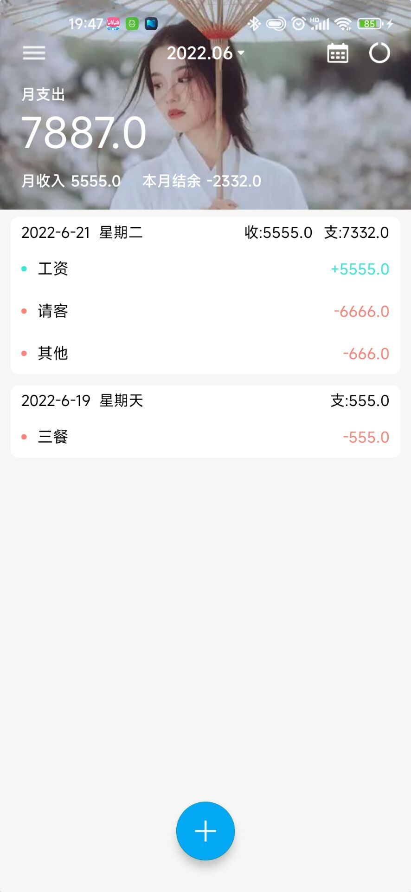
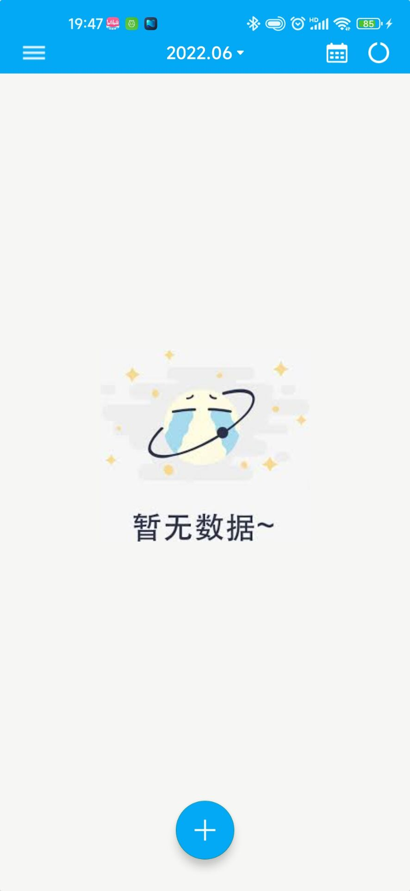
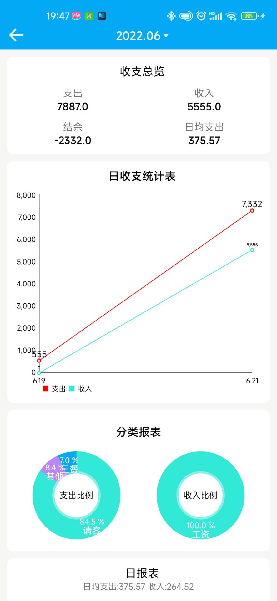
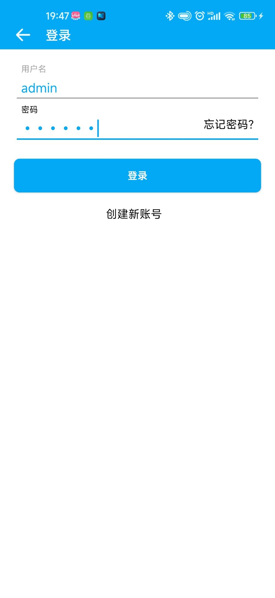

## 简介

记账APP,UI是模仿钱迹的,代码可能很难改,毕竟是第一次写项目.

在api包里是存放后端的,后端代码已经丢失,只剩下jar包和数据库

预算功能可能存在问题,建议使用使将他删除

## UI

## 特点
* 使用 OkHttp + Handler 完成网络请求

## 联系我

* QQ：2928527233
* CSDN：https://blog.csdn.net/weixin_51298509

